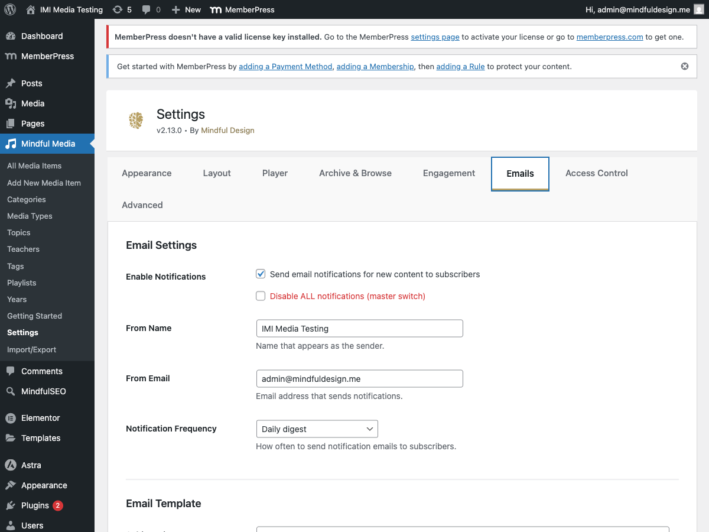

# Email Notifications

MindfulMedia can send email notifications to users when new content is published in their subscribed areas.

## Overview

Email notifications:

- **Notify subscribers** of new content
- **Customizable templates** for branding
- **Flexible scheduling** (instant, hourly, daily)
- **Test functionality** to verify setup

## How It Works

1. User subscribes to a teacher, topic, playlist, or category
2. New content is published in that area
3. Plugin queues notification
4. Email sent based on schedule settings

## Enabling Notifications

Go to **MindfulMedia → Settings → Emails**:

1. Configure sender settings
2. Customize the email template
3. Test with the Send Test button

## Email Settings

### Sender Information

| Setting | Description |
|---------|-------------|
| From Name | Name shown in email "From" field |
| From Email | Email address for sending |

**Recommendations:**

- Use a branded name: "Mindful Design"
- Use a deliverable email: "notifications@yoursite.com"

### Notification Schedule

| Option | Description |
|--------|-------------|
| Instant | Send immediately when content publishes |
| Hourly Digest | Batch into hourly summaries |
| Daily Digest | Batch into daily summaries |

**Digest emails** combine multiple notifications into one email.

## Email Template

### Header

| Setting | Description |
|---------|-------------|
| Header Logo | Upload your logo (optional) |
| Header Text | Text if no logo (defaults to site name) |
| Header Background | Background color |
| Header Text Color | Text color |

### Body

Customize the email body with placeholders:

**Available Placeholders:**

| Placeholder | Description |
|-------------|-------------|
| `{user_name}` | Recipient's display name |
| `{post_title}` | Media item title |
| `{post_excerpt}` | Media item excerpt |
| `{post_url}` | Link to the media item |
| `{term_name}` | Teacher/topic/playlist name |
| `{site_name}` | Your site name |
| `{thumbnail_url}` | Media item thumbnail |
| `{button_color}` | CTA button color |
| `{button_text_color}` | CTA button text color |

**Default Template:**

```html
Hi {user_name},

New content is available from <strong>{term_name}</strong>:

<div style="background: #f5f5f5; padding: 15px; border-radius: 6px; margin: 20px 0;">
<strong>{post_title}</strong>
<p style="margin: 8px 0 0; color: #666;">{post_excerpt}</p>
</div>

<a href="{post_url}" style="display: inline-block; background: {button_color}; color: {button_text_color}; padding: 12px 24px; border-radius: 4px; text-decoration: none; font-weight: 600;">Watch Now</a>
```

### Footer

| Setting | Description |
|---------|-------------|
| Footer Text | Text below the content |

**Default:** "You received this email because you subscribed to updates. Click unsubscribe to stop receiving these emails."

### Colors

| Setting | Description |
|---------|-------------|
| Button Color | CTA button background |
| Button Text Color | CTA button text |

## Test Email

Before relying on notifications, test your setup:

1. Go to **Settings → Emails**
2. Scroll to **Email Preview & Test**
3. Enter your email address
4. Click **Send Test Email**

### Preview

The live preview shows exactly how your email will look:

- Header with logo or text
- Body content with placeholder examples
- Footer with your custom text
- Button with your colors



## Troubleshooting

### Emails Not Sending

**Check these first:**

1. **WordPress Email:** Does `wp_mail()` work?
2. **SMTP Plugin:** Do you have one configured?
3. **Spam Folder:** Check recipient's spam
4. **Logs:** Check WP Mail SMTP logs

**Test email shows success but nothing arrives:**

- `wp_mail()` returning true only means PHP accepted it
- Actual delivery depends on your mail server
- Configure WP Mail SMTP for reliable delivery

### WP Mail SMTP Setup

For reliable delivery:

1. Install **WP Mail SMTP** plugin
2. Configure with a real SMTP provider:
    - SendGrid
    - Mailgun
    - Amazon SES
    - Gmail (for small volume)
3. Verify with test email

### Logo Not Showing

1. Ensure image is uploaded to Media Library
2. Use HTTPS URL for the image
3. Keep logo under 60px height for best display

## Unsubscribe Handling

### In Email

Each email includes an unsubscribe link.

### In My Library

Users can manage subscriptions in **My Library → Subscriptions**.

### Behavior

When unsubscribed:

- Immediately stops notifications
- Removes from subscription table
- No confirmation email (clean removal)

## Best Practices

### Email Frequency

| Scenario | Recommendation |
|----------|----------------|
| High-volume publishing | Daily digest |
| Weekly updates | Instant or daily |
| Breaking news | Instant |

### Content Strategy

- **Compelling subject lines** - Include content title
- **Clear preview text** - Summarize the value
- **Single CTA** - "Watch Now" is clear
- **Mobile-friendly** - Most emails read on mobile

### Deliverability

- Use authenticated email (SPF, DKIM, DMARC)
- Use a reputable SMTP service
- Keep sender reputation clean
- Include unsubscribe option (automatic)

## Database

Notification data stored in:

| Table | Purpose |
|-------|---------|
| `wp_mindful_media_subscriptions` | Who's subscribed to what |
| WordPress options | Email settings/templates |

## Hooks for Developers

```php
// Modify email subject
add_filter('mindful_media_notification_subject', function($subject, $post, $term) {
    return 'New: ' . $subject;
}, 10, 3);

// Modify email body
add_filter('mindful_media_notification_body', function($body, $post, $term, $user) {
    return $body . '<p>Thanks for being a subscriber!</p>';
}, 10, 4);

// Before notification sends
add_action('mindful_media_before_notification', function($user_id, $post_id, $term_id) {
    // Track notification analytics
}, 10, 3);
```
