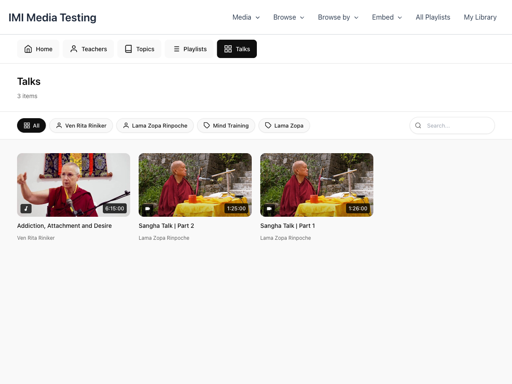

# Media Archive

The Media Archive displays a filterable grid of media items with YouTube-style cards.

## Overview



The Media Archive includes:

- **Filter Chips** - Horizontal scrolling filter buttons
- **Search Bar** - Find specific content
- **Media Grid** - Responsive card layout
- **Pagination** - Navigate through results

## Adding to Your Site

### Using Shortcode

```html
[mindful_media_archive]
```

### With Filters

```html
<!-- Only meditation content -->
[mindful_media_archive topic="meditation"]

<!-- Only video content -->
[mindful_media_archive type="video"]

<!-- Specific teacher -->
[mindful_media_archive teacher="john-smith"]

<!-- Featured items only -->
[mindful_media_archive featured="true"]
```

### Pagination Options

```html
<!-- 24 items per page -->
[mindful_media_archive per_page="24"]

<!-- Without pagination -->
[mindful_media_archive show_pagination="false"]
```

## Filter Chips

Filter chips appear as horizontal scrolling buttons above the grid.

### Available Filters

| Filter | Description |
|--------|-------------|
| All | Show all items |
| Topics | Filter by topic |
| Teachers | Filter by teacher |
| Playlists | Filter by playlist |
| Categories | Filter by category |
| Audio | Show only audio |
| Video | Show only video |

### Customizing Filters

Hide filters entirely:

```html
[mindful_media_archive show_filters="false"]
```

Configure which filters appear in **Settings → Archive & Browse**.

## Media Cards

Each media item displays as a card with:

- **Thumbnail** - 16:9 aspect ratio image
- **Duration Badge** - Bottom right corner
- **Play Overlay** - Appears on hover
- **Title** - Below the thumbnail
- **Meta Info** - Teacher, date, duration

### Card Interaction

- **Hover** - Shows play button overlay
- **Click** - Opens modal player

## Grid Layout

### Responsive Columns

The grid automatically adjusts:

| Screen Width | Columns |
|--------------|---------|
| Desktop (1200px+) | 5 columns |
| Large Tablet (992px+) | 4 columns |
| Tablet (768px+) | 3 columns |
| Mobile (576px+) | 2 columns |
| Small Mobile | 1 column |

### Customizing Columns

Set the default columns in **Settings → Layout → Items Per Row**.

## Search

The archive includes an inline search bar:

- Type to filter results
- AJAX-powered instant results
- Searches titles and descriptions

## Pre-Filtering

Use shortcode attributes to create focused archives:

### Teacher's Page

```html
<h2>Content by John Smith</h2>
[mindful_media_archive teacher="john-smith" per_page="12"]
```

### Topic Page

```html
<h2>Meditation Videos</h2>
[mindful_media_archive topic="meditation" type="video"]
```

### Featured Gallery

```html
<h2>Featured Content</h2>
[mindful_media_archive featured="true" per_page="6" show_pagination="false"]
```

## Styling

### CSS Variables

```css
--mm-card-radius: 12px;
--mm-card-gap: 16px;
--mm-thumbnail-ratio: 16/9;
```

### Custom CSS

```css
/* Card styling */
.mindful-media-card {
    /* Your styles */
}

/* Grid layout */
.mindful-media-archive-grid {
    /* Your styles */
}

/* Filter chips */
.mindful-media-filter-chips {
    /* Your styles */
}
```

## Navigation URL

Set your archive page URL in **Settings → Archive & Browse → Media Archive URL**.

This URL is used for:

- "View All Media" links
- Breadcrumb navigation
- Return links from single media pages
