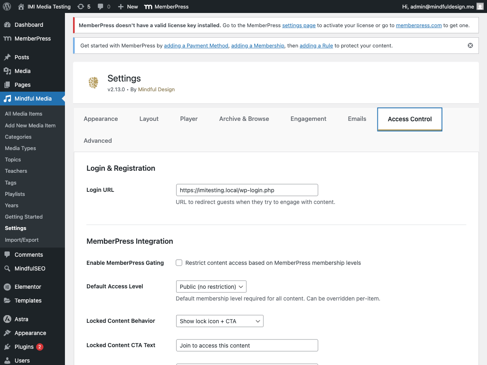
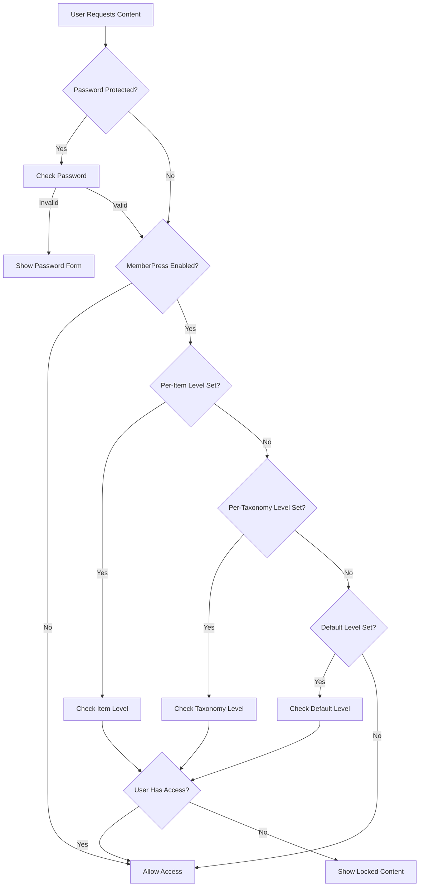

# MemberPress Integration

MindfulMedia integrates with MemberPress to restrict content based on membership levels.

## Overview

With MemberPress integration you can:

- **Gate content by membership level**
- **Set global defaults** for all content
- **Override per-item** for specific media
- **Override per-taxonomy** for teachers/topics/playlists
- **Customize locked content messaging**
- **Direct users to membership-specific signup pages**

## Requirements

- MemberPress plugin (installed and activated)
- At least one membership level created

## Enabling Integration

1. Go to **MindfulMedia → Settings → Access Control**
2. Check **Enable MemberPress Gating**
3. Configure settings
4. Save



## Configuration Options

### Default Access Level

Set the default membership required for all content:

| Option | Description |
|--------|-------------|
| Public | No membership required |
| [Membership Name] | Requires specific membership |

**Note:** This affects all content unless overridden per-item.

### Locked Content Behavior

How locked content displays:

| Option | Description |
|--------|-------------|
| Show Lock + CTA | Display lock icon with call-to-action |
| Hide Completely | Don't show locked content at all |

### Locked Content CTA Text

Customize the message shown on locked content:

```
Default: "Join to access this content"
```

### Default Join URL

The URL for the "Join" button on locked content.

### Per-Membership URLs

Set specific signup URLs for each membership level:

| Membership | URL |
|------------|-----|
| Free | (Use default) |
| Premium | https://yoursite.com/join-premium |
| VIP | https://yoursite.com/join-vip |

**How it works:**

1. User tries to access Premium-only content
2. Lock message shows with "Join" button
3. Button links to Premium signup page (not generic pricing)

## Per-Item Overrides

Override the default on individual media items:

1. Edit the media item
2. Find **MemberPress Access** section
3. Select required membership levels
4. Save

### Options

- **Use Default** - Inherit from global settings
- **Public** - Override to make public
- **[Specific Level]** - Require specific membership

## Per-Taxonomy Overrides

Restrict entire taxonomies:

### Teachers

1. Edit the teacher
2. Find **MemberPress Access** section
3. Select required levels
4. Save

**Effect:** All content by this teacher requires the membership.

### Topics

Same process - restrict all content in a topic.

### Playlists

Same process - restrict all content in a playlist.

### Categories

Same process - restrict all content in a category.

## Locked Content Display

When content is locked, users see:

### Lock Overlay

- Lock icon
- Custom message (CTA text)
- "Join" button (links to signup)
- "Already a member? Log in" link

### Guest vs. Member

| User Type | What They See |
|-----------|---------------|
| Guest | Lock overlay with signup prompt |
| Wrong Membership | Lock overlay with upgrade prompt |
| Correct Membership | Full content access |

## Access Check Logic

The plugin checks access in this order:



## Login URL

Set the login page URL for "Already a member?" links:

**Settings → Access Control → Login URL**

Default: WordPress login page with redirect back.

## Styling Locked Content

```css
/* Lock overlay */
.mindful-media-lock-overlay {
    background: rgba(0, 0, 0, 0.8);
}

/* Lock icon */
.mindful-media-lock-icon svg {
    fill: white;
}

/* Lock message */
.mindful-media-lock-title {
    color: white;
    font-size: 1.5rem;
}

/* Join button */
.mindful-media-lock-cta {
    background: var(--mm-primary-color);
    color: white;
}

/* Login link */
.mindful-media-lock-login a {
    color: #aaa;
}
```

## Best Practices

### Membership Structure

```
Free Membership
├── Access to: Sample content, first lessons
├── Locked: Full courses, premium content

Premium Membership
├── Access to: All courses, all content
├── Locked: (nothing)

VIP Membership
├── Access to: Everything
├── Exclusive: 1-on-1 coaching content
```

### Per-Level URLs

Set up landing pages for each level:

- `/join-free` - Explains free tier
- `/join-premium` - Premium benefits and pricing
- `/join-vip` - VIP exclusive offer

### Content Strategy

1. **Teaser Content** - Some free items to demonstrate value
2. **Core Content** - Requires basic membership
3. **Premium Content** - Higher tier membership
4. **Exclusive Content** - Top tier only

## Troubleshooting

### Content Not Locking

1. Verify MemberPress is active
2. Check "Enable MemberPress Gating" is on
3. Verify default level or per-item level is set
4. Clear any caching

### Wrong Content Locked

1. Check per-item settings (may override default)
2. Check taxonomy settings
3. Review the access hierarchy

### Users Can't Access Content

1. Verify user has correct membership
2. Check membership is active (not expired)
3. Review MemberPress subscription status
