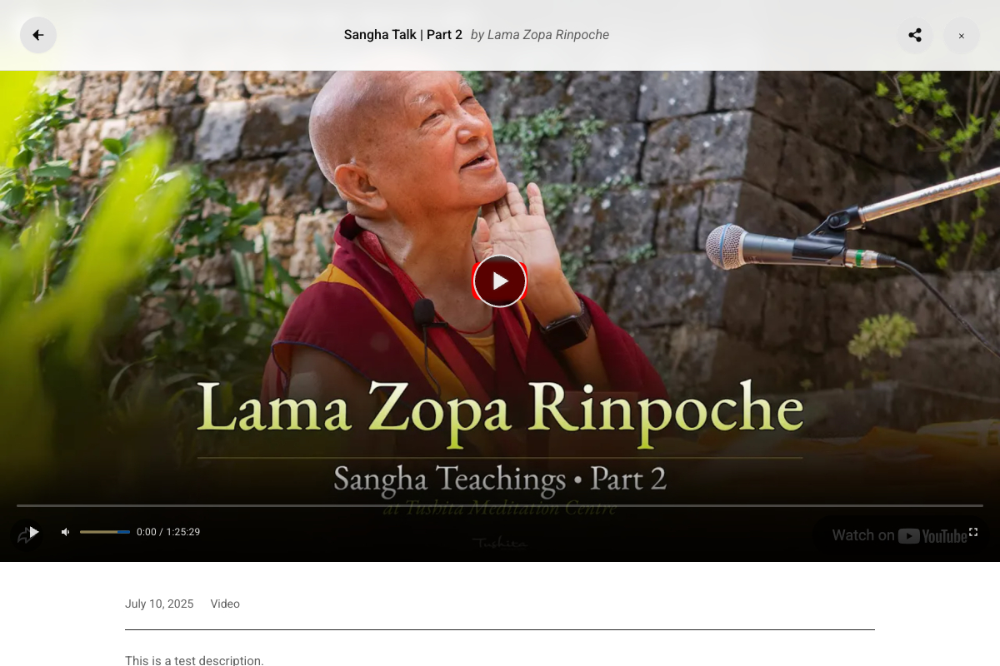

# Modal Player

The Modal Player provides an immersive viewing experience with a YouTube-style interface.

## Overview



The Modal Player includes:

- **Full-Screen Overlay** - Dark background for focus
- **Video/Audio Player** - Embedded from source
- **Playlist Sidebar** - Navigate playlist items
- **Progress Tracking** - Remember where you left off
- **Engagement Actions** - Like, share, subscribe

## Opening the Modal

The modal opens when you:

- Click a media card thumbnail
- Click a media embed
- Navigate directly to a media URL

## Player Features

### Video Sources

Supported video platforms:

| Platform | Embed Type |
|----------|------------|
| YouTube | IFrame API |
| Vimeo | Player API |
| SoundCloud | Widget API |
| Archive.org | IFrame |
| Direct URLs | HTML5 Video |

### Audio Player

For audio content:

- Custom styled audio controls
- Volume slider with brand colors
- Progress bar with time display
- Album artwork display

### Progress Bar

- Draggable progress indicator
- Time elapsed / total duration
- Color matches your brand settings

## Playlist Sidebar

When viewing content in a playlist:

The modal shows a "More Media" sidebar with related content:


### Features

- **Collapsible Modules** - Organize into sections
- **Current Item Highlight** - Shows playing item
- **Progress Indicators** - Checkmarks for completed
- **Quick Navigation** - Click to switch items

### Module Structure

Playlists can have parent/child structure:

```
Complete Course (Parent Playlist)
├── Module 1: Introduction (Child Playlist)
│   ├── Video 1.1
│   ├── Video 1.2
│   └── Video 1.3
├── Module 2: Fundamentals (Child Playlist)
│   ├── Video 2.1
│   └── Video 2.2
└── Module 3: Advanced (Child Playlist)
    ├── Video 3.1
    └── Video 3.2
```

## Header Actions

### Close Button

Returns to the previous page or closes the modal.

### Share Button

Opens a share dialog with:

- Copy link to clipboard
- Social sharing options

### Back Button

Navigate back in playlist history.

## Engagement Section

Below the player:

### Like Button

- Heart icon with like count
- Click to like/unlike
- Requires login

### Subscribe Button

- Subscribe to the teacher/topic
- Get notified of new content
- Requires login

### Comments

- View existing comments
- Add new comments (if logged in)
- Moderation options available

## Progress Tracking

### How It Works

1. Plugin tracks playback position
2. Saves progress every few seconds
3. Stores in `playback_progress` table
4. Resumes from saved position on return

### Continue Watching

Progress tracking enables:

- **Continue Watching** section in My Library
- Resume playback from last position
- Progress indicators on cards

### Completion Threshold

- Progress < 90% = "Continue Watching"
- Progress >= 90% = Marked as complete

## Keyboard Shortcuts

| Key | Action |
|-----|--------|
| Space | Play/Pause |
| ← / → | Seek backward/forward |
| ↑ / ↓ | Volume up/down |
| M | Mute/Unmute |
| F | Fullscreen |
| Esc | Close modal |

## Theming

The modal uses a dark theme:

```css
--mm-dark-bg-primary: #0f0f0f;
--mm-dark-bg-secondary: #212121;
--mm-dark-text-primary: #f1f1f1;
--mm-dark-text-secondary: #aaaaaa;
```

### Customizing

```css
/* Modal background */
.mindful-media-modal {
    background: rgba(0, 0, 0, 0.95);
}

/* Player container */
.mindful-media-player-container {
    /* Your styles */
}

/* Sidebar */
.mindful-media-playlist-sidebar {
    /* Your styles */
}
```

## Settings

Configure modal behavior in **Settings → Player**:

| Setting | Description |
|---------|-------------|
| Autoplay | Start playing automatically |
| Show Related | Show related videos after |
| Progress Color | Color for progress bar |
| Hide YouTube End Screen | Cover YouTube's recommendations |
