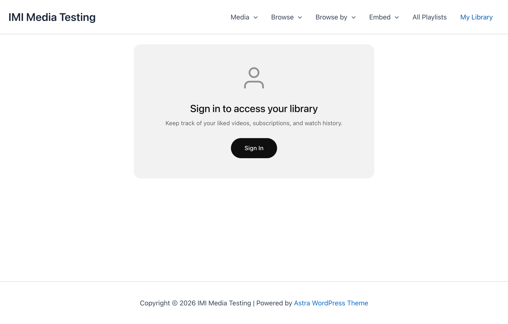

# My Library

My Library is a personal dashboard where users can access their liked content, watch history, and subscriptions.

## Overview



My Library includes:

- **Continue Watching** - Resume incomplete videos
- **Liked Videos** - Favorited content
- **Watch History** - Recently viewed
- **Subscriptions** - Followed teachers/topics

## Auto-Created Page

A "My Library" page is automatically created when MindfulMedia is activated:

- Page contains `[mindful_media_library]` shortcode
- Accessible to logged-in users
- Can be renamed or moved

## Adding to Your Site

### Already Created

Check **Pages** for "My Library" - it's created on activation.

### Manual Setup

Create a page with:

```html
[mindful_media_library]
```

### Menu Integration

Add to your navigation menu:

1. Go to **Appearance → Menus**
2. Add the "My Library" page
3. Optionally show only to logged-in users

## Sections

### Continue Watching

Shows videos with saved progress:

- Progress bar indicator
- Resume from where you left off
- Automatically appears when progress exists
- Videos removed when completed (>90%)

**Logic:**

- Checks `playback_progress` table
- Filters items with progress < 90%
- Orders by last viewed date

### Liked Videos

All videos the user has liked:

- Grid display with thumbnails
- Click to watch
- Unlike available in modal

**Logic:**

- Pulls from `likes` table
- Ordered by like date (newest first)

### Watch History

Chronological history of viewed videos:

- Recently watched first
- Shows view timestamp
- Click to rewatch

**Logic:**

- Pulls from `watch_history` table
- Ordered by view timestamp

### Subscriptions

Manage all subscriptions:

| Subscription Type | Display |
|------------------|---------|
| Teachers | Teacher name with toggle |
| Topics | Topic name with toggle |
| Playlists | Playlist name with toggle |
| Categories | Category name with toggle |

**Features:**

- Toggle email notifications
- One-click unsubscribe
- Grouped by type

## WooCommerce Integration

Optionally add My Library as a WooCommerce My Account tab.

### Enabling

1. Go to **Settings → Engagement**
2. Enable **WooCommerce My Account Tab**
3. Save settings

### Result

- New "My Library" tab in WooCommerce My Account
- Same content as the standalone page
- Integrates with existing account area

## Login Required

My Library requires authentication:

### Logged-In Users

- Full access to all sections
- Personal data only

### Guests

- See login prompt
- Link to login page
- Optional registration link

### Customizing Login Prompt

```css
.mm-library-login-prompt {
    /* Prompt container */
}

.mm-library-login-prompt a {
    /* Login link */
}
```

## User Profile Header

The My Library page can display a profile header:

- User avatar
- Display name
- Member since date
- Quick stats (liked, watched, subscribed)

## Customization

### CSS Styling

```css
/* Library container */
.mindful-media-library {
    /* Main container */
}

/* Section headers */
.mm-library-section-header {
    /* Section titles */
}

/* Card grid */
.mm-library-grid {
    /* Grid layout */
}

/* Continue watching progress */
.mm-continue-progress {
    /* Progress bar */
}
```

### Settings

Configure in **Settings → Engagement**:

| Setting | Description |
|---------|-------------|
| Library Page | Select the library page |
| WooCommerce Tab | Enable My Account integration |

## Empty States

When sections have no content:

- **Continue Watching** - "Start watching to see progress here"
- **Liked Videos** - "Like videos to save them here"
- **History** - "Your watch history will appear here"
- **Subscriptions** - "Subscribe to get notified of new content"

## Privacy

- Library data is private to each user
- Not visible to other users
- Not visible to admins (except in database)
- Users control their own data

## Best Practices

### Promote the Library

- Add to main navigation
- Mention in onboarding
- Link from profile areas

### Clear Messaging

- Explain what each section does
- Guide users to like/subscribe
- Show value of tracking progress

### Mobile Experience

- Library is fully responsive
- Swipe-friendly cards
- Touch-friendly toggles
