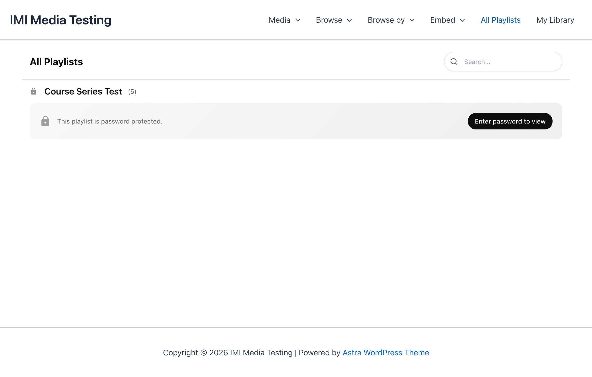

# Playlists

Playlists allow you to group and organize media content into courses, series, and collections.

## Overview

Playlists in MindfulMedia support:

- **Sequential Content** - Ordered media items
- **Modular Structure** - Group into chapters/modules
- **Password Protection** - Restrict access
- **Progress Tracking** - Track completion

## Creating Playlists

### Basic Playlist

1. Go to **MindfulMedia → Playlists**
2. Click **Add New**
3. Enter a name and description
4. Optionally add a featured image
5. Click **Add New Playlist**

### Assigning Media to Playlists

1. Edit a media item
2. In the **Playlists** sidebar, check the desired playlist
3. Save the media item

## Playlist Structure

### Simple Playlist

All items in a flat list:

```
Beginner Meditation Course
├── Introduction to Meditation
├── Breathing Techniques
├── Body Scan Practice
├── Guided Meditation #1
└── Guided Meditation #2
```

### Modular Playlist (Course Structure)

Create child playlists for chapters:

```
Complete Yoga Course (Parent)
├── Week 1: Foundations (Child/Module)
│   ├── Day 1 - Introduction
│   ├── Day 2 - Sun Salutation
│   └── Day 3 - Standing Poses
├── Week 2: Building Strength (Child/Module)
│   ├── Day 1 - Core Work
│   ├── Day 2 - Arm Balances
│   └── Day 3 - Backbends
└── Week 3: Advanced (Child/Module)
    ├── Day 1 - Inversions
    └── Day 2 - Final Practice
```

### Creating Modules

1. Create the parent playlist first
2. Create child playlists
3. Set **Parent Playlist** to the main course
4. Assign videos to the appropriate module

## Password Protection

Restrict playlist access with passwords.

### Enabling Protection

1. Edit the playlist
2. Check **Enable Password Protection**
3. Enter a password
4. Save

### User Experience

- Playlist cards show a lock icon
- Users must enter password to view
- Password stored in cookie after entry
- Access persists for the session



## Displaying Playlists

### Embed a Playlist

```html
[mindful_media playlist="beginner-course"]
```

Opens the first item with the playlist sidebar visible.

### Playlist Archive

```html
[mindful_media_taxonomy_archive taxonomy="media_series" title="All Courses"]
```

Shows all playlists with their content.

### Playlist Row

```html
[mindful_media_row taxonomy="media_series" title="Featured Courses"]
```

Horizontal slider of playlist cards.

## Playlist Sidebar

When viewing playlist content in the modal:

### Features

- Shows all items in the playlist
- Highlights current item
- Collapsible module sections
- Click to navigate between items

### Navigation

- **Up/Down** - Move through items
- **Click** - Jump to specific item
- **Module Headers** - Expand/collapse

## Ordering Items

### Within WordPress

Items appear in the order they were added to the playlist by default.

### Custom Ordering

Use a plugin like "Simple Custom Post Order" to drag-and-drop reorder items within each playlist.

### Order by Date

In settings, configure whether items order by:

- Date added to playlist
- Post publish date
- Custom order

## Playlist Settings

### In Media Item Editor

| Field | Description |
|-------|-------------|
| Playlists | Assign to one or more playlists |
| Order in Playlist | Position override |

### In Playlist Editor

| Field | Description |
|-------|-------------|
| Name | Playlist title |
| Description | Playlist summary |
| Parent | Make this a module under another playlist |
| Featured Image | Playlist thumbnail |
| Password Protection | Enable/disable |
| Password | Access password |

## Progress Tracking

### Per-Item Progress

Each video tracks:

- Current playback position
- Completion status (>90% = complete)

### Playlist Completion

- Shows progress indicator
- Counts completed vs total items
- Updates in My Library

## Best Practices

### Course Structure

1. **Create logical modules** - Group by topic or week
2. **Keep modules focused** - 3-7 items per module
3. **Order logically** - Build on previous content
4. **Use descriptive names** - Clear titles help navigation

### Password Protection

- **Use for premium content** - Gate valuable courses
- **Share passwords carefully** - Email to purchasers
- **Consider MemberPress** - For robust access control

### Organization

- **One series per course** - Don't mix unrelated content
- **Consistent naming** - "Module 1: Topic" format
- **Featured images** - Help users identify content
