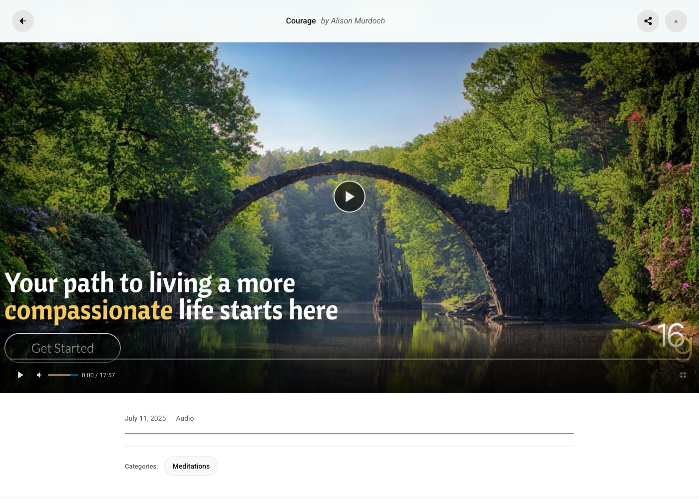

# User Engagement

MindfulMedia includes built-in engagement features to help users interact with your content.

## Overview

Engagement features include:

- **Likes** - Users can like media items
- **Comments** - Discussion on media items
- **Subscriptions** - Follow teachers, topics, playlists
- **Watch History** - Track viewed content
- **Progress Tracking** - Remember playback position

## Enabling Engagement

Go to **MindfulMedia → Settings → Engagement**:

| Setting | Description |
|---------|-------------|
| Enable Likes | Allow users to like content |
| Enable Comments | Allow comments on media |
| Enable Subscriptions | Allow following taxonomies |
| Auto-Approve Comments | Skip moderation queue |

## Likes

### How It Works

1. Logged-in users see a heart icon
2. Click to like/unlike
3. Like count updates instantly
4. Liked items appear in My Library

### Display Locations

- Single media page
- Modal player
- Media cards (optional)

### For Guests

Guest users see a prompt to log in to like content.



## Comments

### Features

- Threaded discussions
- User avatars
- Timestamps
- Moderation options

### Moderation

**Auto-Approve Mode:**

- Comments appear immediately
- Good for trusted communities

**Manual Approval:**

- Comments held for review
- Admin approves in WordPress
- Better spam control

### Display

Comments appear below the player on:

- Single media pages
- Modal player (scrollable)

### Managing Comments

1. Go to **Comments** in WordPress admin
2. Filter by media item
3. Approve, edit, or delete

## Subscriptions

Users can subscribe to:

| Type | Notification Trigger |
|------|---------------------|
| Teachers | New content by that teacher |
| Topics | New content in that topic |
| Playlists | New items added to playlist |
| Categories | New content in category |

### Subscribe Button

Appears on:

- Single media pages
- Modal player
- Taxonomy archive pages

### Managing Subscriptions

Users manage subscriptions in **My Library → Subscriptions**:

- View all active subscriptions
- Toggle notifications on/off
- Unsubscribe with one click

## Watch History

### Automatic Tracking

When a user views media:

1. Entry created in watch history
2. Timestamp recorded
3. Duration tracked

### Viewing History

Users see their history in **My Library → History**:

- Chronological list
- Thumbnails and titles
- Click to resume watching

### Privacy

- History is private to each user
- Not visible to other users
- Can be cleared by user (future feature)

## Progress Tracking

### How It Works

1. Video playback position saved periodically
2. Stored per-user, per-video
3. Resumes from saved position

### Continue Watching

Videos with progress (< 90%) appear in:

- My Library → Continue Watching
- Homepage (optional)

### Completion

- Progress >= 90% = marked complete
- Removed from Continue Watching
- Checkmark shown in playlists

## Database Tables

Engagement data stored in custom tables:

| Table | Purpose |
|-------|---------|
| `wp_mindful_media_likes` | Like records |
| `wp_mindful_media_comments` | Comment data |
| `wp_mindful_media_subscriptions` | Subscription records |
| `wp_mindful_media_watch_history` | View history |
| `wp_mindful_media_playback_progress` | Resume positions |

## Data Retention

In **Settings → Advanced → Data Management**:

- **Keep data on uninstall** - Preserve engagement data
- **Delete data on uninstall** - Remove all custom tables

## Guest Prompts

Non-logged-in users see prompts:

- "Log in to like this video"
- "Create an account to subscribe"
- Links to login/registration pages

### Customizing Login URL

Set the login page URL in **Settings → Access Control → Login URL**.

## Styling Engagement UI

### Like Button

```css
.mm-like-btn {
    /* Button styling */
}

.mm-like-btn.liked {
    /* Active state */
}

.mm-like-count {
    /* Count display */
}
```

### Subscribe Button

```css
.mm-subscribe-btn {
    /* Button styling */
}

.mm-subscribe-btn.subscribed {
    /* Subscribed state */
}
```

### Comments

```css
.mm-comments-section {
    /* Container */
}

.mm-comment {
    /* Individual comment */
}

.mm-comment-form {
    /* Comment input */
}
```
