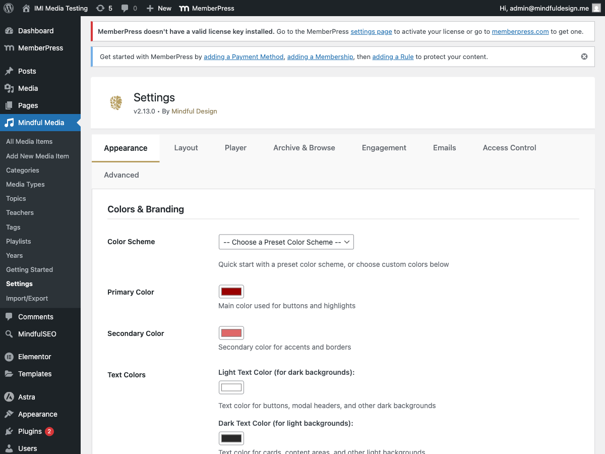
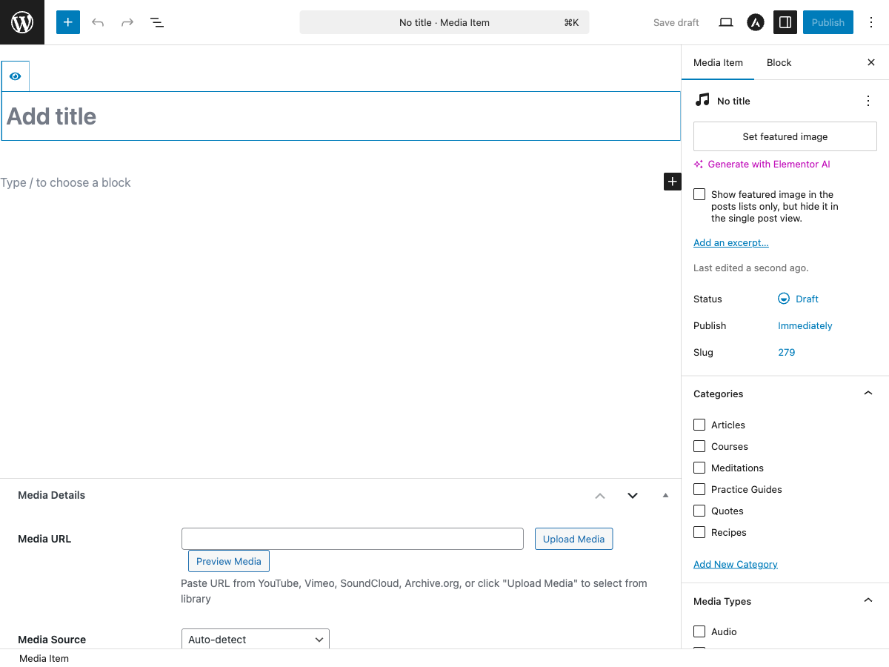

# Getting Started

This guide will walk you through installing MindfulMedia and setting up your first media library.

## Installation

### From WordPress Admin

1. Go to **Plugins → Add New**
2. Click **Upload Plugin**
3. Select the `mindfulmedia.zip` file
4. Click **Install Now**
5. Click **Activate Plugin**

### Manual Installation

1. Download the plugin ZIP file
2. Extract to `/wp-content/plugins/mindfulmedia/`
3. Go to **Plugins** in WordPress admin
4. Find "MindfulMedia" and click **Activate**

## Initial Setup

After activation, MindfulMedia automatically:

- Creates the `mindful_media` custom post type
- Registers all taxonomies (Teachers, Topics, Categories, Playlists, Types)
- Creates a "My Library" page with the library shortcode
- Sets up default settings

### First Steps

#### 1. Configure Basic Settings

Go to **MindfulMedia → Settings** and configure:

- **Appearance** - Set your brand colors
- **Layout** - Configure card sizes and grid layouts
- **Player** - Set player behavior and autoplay options



#### 2. Create Your First Media Item

Go to **MindfulMedia → Add New** to create your first media item:

1. Enter a **Title** for your media
2. Add a **Featured Image** (thumbnail)
3. In the **Media Source** section:
    - Select the source type (YouTube, Vimeo, SoundCloud, etc.)
    - Paste the video/audio URL
4. Set the **Duration** (or click "Fetch Duration" to auto-detect)
5. Assign **Taxonomies**:
    - Teacher (who created the content)
    - Topic (subject matter)
    - Category (content type)
    - Playlist (optional, for series)
6. Click **Publish**



#### 3. Create a Browse Page

Create a new page and add the browse shortcode:

```
[mindful_media_browse]
```

Or use the **MindfulMedia Browse** Gutenberg block.

This creates a full browsing experience with:

- Navigation tabs (Home, Teachers, Topics, Playlists)
- Featured content section
- Category sliders

#### 4. Create a Media Archive Page

For a simple grid of all media items:

```
[mindful_media_archive per_page="12"]
```

## Setting Up Taxonomies

### Teachers

Teachers represent content creators or instructors.

1. Go to **MindfulMedia → Teachers**
2. Add a new teacher with:
    - Name
    - Description/Bio
    - Featured Image (profile photo)

### Topics

Topics categorize content by subject matter.

1. Go to **MindfulMedia → Topics**
2. Add topics like "Meditation", "Yoga", "Mindfulness"
3. Add featured images for visual browsing

### Playlists (Series)

Playlists group related content in order.

1. Go to **MindfulMedia → Playlists**
2. Create a playlist (e.g., "Beginner Course")
3. Optionally create child playlists as "modules"
4. Enable password protection if needed

### Categories

Categories provide additional organization.

1. Go to **MindfulMedia → Categories**
2. Add categories with featured images

## Creating Playlists

Playlists are powerful for creating courses and series:

### Simple Playlist

1. Create a playlist: **MindfulMedia → Playlists → Add New**
2. Assign media items to it when editing each item
3. Items appear in the playlist sidebar when viewing

### Modular Playlist (Course Structure)

1. Create a parent playlist (e.g., "Complete Course")
2. Create child playlists as modules:
    - "Module 1: Introduction"
    - "Module 2: Fundamentals"
    - "Module 3: Advanced"
3. Assign videos to the appropriate module
4. The modal player shows a collapsible module structure

### Password Protected Playlist

1. Edit the playlist
2. Enable "Password Protection"
3. Set a password
4. Only users with the password can view the content

## Adding Media to Pages

### Using Shortcodes

```html
<!-- Full browse page -->
[mindful_media_browse]

<!-- Media grid with filters -->
[mindful_media_archive per_page="12" category="meditation"]

<!-- Single media embed -->
[mindful_media id="123"]

<!-- Embed a playlist -->
[mindful_media playlist="beginner-course"]

<!-- Category row slider -->
[mindful_media_row taxonomy="media_topic" title="Browse by Topic"]
```

### Using Gutenberg Blocks

1. Edit a page with Gutenberg
2. Click **+** to add a block
3. Search for "MindfulMedia"
4. Choose from:
    - **MindfulMedia Browse** - Full browse layout
    - **MindfulMedia Archive** - Grid with filters
    - **MindfulMedia Embed** - Single item or playlist
    - **MindfulMedia Category Row** - Horizontal slider

### Using Elementor

1. Edit a page with Elementor
2. Search widgets for "MindfulMedia"
3. Drag the widget to your canvas
4. Configure options in the sidebar

## What's Next?

Now that you have the basics set up:

- [Configure all settings](settings/appearance.md)
- [Set up user engagement](features/user-engagement.md)
- [Integrate with MemberPress](features/memberpress.md)
- [Customize email notifications](features/email-notifications.md)
