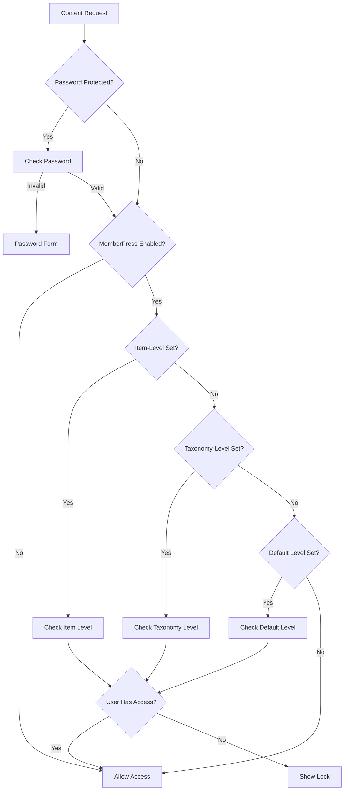

# Access Control Settings

Configure content access restrictions and MemberPress integration.

## Accessing Settings

Go to **MindfulMedia → Settings → Access Control**

## MemberPress Integration

### Requirements

- MemberPress plugin installed and activated
- At least one membership level created

### Enabling Gating

| Setting | Description |
|---------|-------------|
| Enable MemberPress Gating | Master toggle for access control |

When disabled, all content is publicly accessible.

## Access Level Settings

### Default Access Level

| Option | Effect |
|--------|--------|
| Public (no restriction) | All content accessible to everyone |
| [Membership Name] | All content requires that membership |

**Note:** Can be overridden per-item or per-taxonomy.

### Locked Content Behavior

| Option | Effect |
|--------|--------|
| Show lock icon + CTA | Display lock overlay with join button |
| Hide completely | Don't show locked content at all |

### Locked Content CTA Text

Customize the message on locked content:

```
Default: "Join to access this content"
```

### Login URL

URL for "Already a member? Log in" links.

**Default:** WordPress login with redirect back.

**Custom:** Your custom login page URL.

## Join URLs

### Default Join URL

The URL for "Join" buttons on locked content.

**Example:** `https://yoursite.com/pricing`

### Per-Membership URLs

Set specific URLs for each membership level:

| Membership | URL | Use |
|------------|-----|-----|
| Free | (default) | Generic signup |
| Premium | `/join-premium` | Premium signup page |
| VIP | `/join-vip` | VIP signup page |

**How it works:**

1. Content requires "Premium" membership
2. Non-member clicks "Join"
3. Redirected to `/join-premium` (not generic pricing)

## Override Hierarchy

Access checks follow this order:

```
1. Per-Item Setting (highest priority)
   ↓ if not set
2. Per-Taxonomy Setting (teacher, topic, etc.)
   ↓ if not set
3. Global Default Setting
   ↓ if not set
4. Public Access (no restriction)
```

### Per-Item Override

Edit any media item → MemberPress Access section:

| Option | Effect |
|--------|--------|
| Use Default | Inherit from taxonomy or global |
| Public | Override to make public |
| [Membership] | Require specific membership |

### Per-Taxonomy Override

Edit any teacher/topic/playlist/category → MemberPress Access:

| Option | Effect |
|--------|--------|
| None | Use item or global default |
| [Membership] | All content in this taxonomy requires membership |

## Access Check Flow



## Locked Content Display

### What Users See

**Guest Users:**

- Lock icon overlay
- CTA message
- "Join" button → Join URL
- "Log in" link → Login URL

**Wrong Membership:**

- Lock icon overlay
- Upgrade message
- "Upgrade" button → Membership-specific URL

**Correct Membership:**

- Full content access
- No lock overlay

## Styling Locked Content

```css
/* Lock overlay */
.mindful-media-lock-overlay {
    position: absolute;
    inset: 0;
    background: rgba(0, 0, 0, 0.85);
    display: flex;
    flex-direction: column;
    align-items: center;
    justify-content: center;
}

/* Lock icon */
.mindful-media-lock-icon {
    width: 64px;
    height: 64px;
    margin-bottom: 16px;
}

/* Lock message */
.mindful-media-lock-title {
    font-size: 1.25rem;
    color: white;
    margin-bottom: 16px;
}

/* Join button */
.mindful-media-lock-cta {
    padding: 12px 24px;
    background: var(--mindful-media-secondary);
    color: white;
    border-radius: 4px;
    text-decoration: none;
}

/* Login link */
.mindful-media-lock-login {
    margin-top: 16px;
    color: #aaa;
}
```

## Best Practices

### Content Strategy

```
Free Tier:
├── Sample content
├── First lessons of courses
└── Promotional content

Premium Tier:
├── Full courses
├── Exclusive teachers
└── Advanced content

VIP Tier:
├── Everything in Premium
├── 1-on-1 coaching content
└── Early access
```

### URL Strategy

Create dedicated landing pages:

- `/pricing` - Compare all plans
- `/join-free` - Free tier benefits
- `/join-premium` - Premium benefits + signup
- `/join-vip` - VIP exclusive offer

### User Experience

- Show value before locking
- Clear upgrade path
- Easy login for existing members
- Mobile-friendly lock overlays
